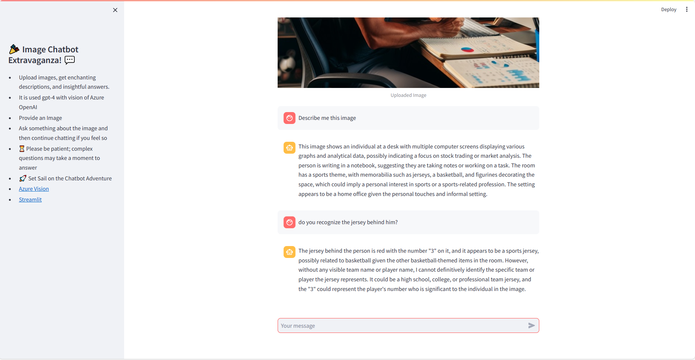

## Simple Image Chatbot! 💬🤖🖼️

Welcome to the Image Chatbot Extravaganza! This delightful chatbot, powered by GPT-4 and Azure OpenAI's vision, is designed to provide enchanting descriptions and insightful answers for your uploaded images. 🚀

### How to Chat:

1. **Upload an Image:** Click the "Upload your Image" button to share a captivating picture in PNG or JPG format.

2. **Ask a Question:** Enter your initial question or text about the image in the provided text box. If you're feeling adventurous, continue the chat with additional questions.

3. **Enjoy the Adventure:** Please be patient, especially with complex questions; our chatbot is working hard to provide you with the best responses.

### Quick Links:

- [GPT-4 Vision - Azure](https://learn.microsoft.com/en-us/azure/ai-services/openai/how-to/gpt-with-vision): Learn more about the powerful vision capabilities of Azure GPT-4 Vision.
- [Streamlit](https://streamlit.io/): Explore the magic behind the interactive web app framework.

### Instructions for Developers:

To run the Image Chatbot Extravaganza on your local machine, simply execute the following command:

```bash
streamlit run app.py
```

## Python Scripts

- **app.py:** The primary program utilizes Streamlit for the frontend and functions from **image_functions.py** to create an interactive application.
- **image_functions.py:** Contains three functions that communicate with Azure OpenAI (GPT-4) using requests.
  - **initialize_chat:** Takes an image and text to initialize the conversation with GPT-4. Returns GPT response, payload, and headers.
  - **new_question_to_chat:** Takes payload, a new question, and headers. Continues the conversation with GPT-4, considering previous messages. Returns GPT response and payload.
  - **add_assistant_reply:** A helper function to add the GPT response to the payload.

**Note: Payload** refers to the data sent as part of an HTTP request, included in the body to transmit information from the client to the server.

## Example from the app


